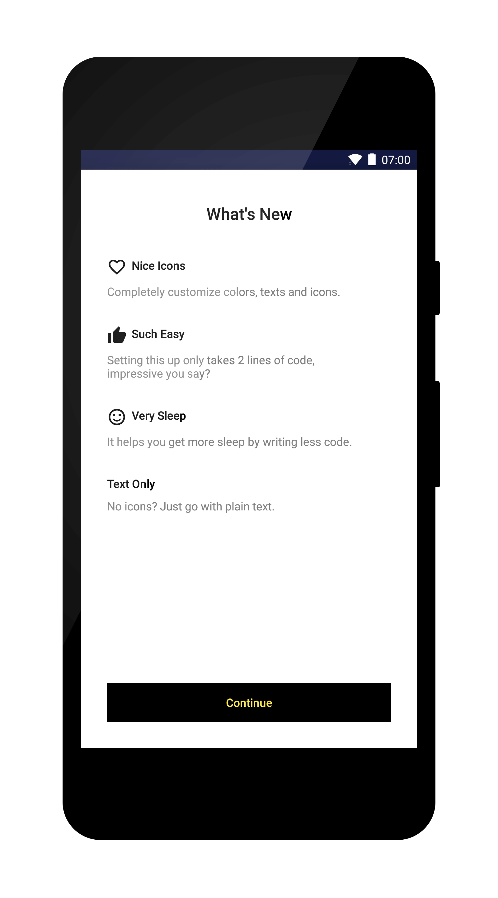

# WhatsNew
[](https://github.com/TonnyL/WhatsNew/actions?query=workflow%3Abuild)

[](https://bintray.com/tonnyl/maven/whatsnew/_latestVersion)
[](LICENSE)

<p align="center"></p>

`WhatsNew` automatically displays a short description of the new features when users update your app. Inspired by [WhatsNew](https://github.com/BalestraPatrick/WhatsNew).

## Download
### Gradle
Add the code to your **module**'s build.gradle file:

```gradle
dependencies {
    implementation 'io.github.tonnyl:whatsnew:x.y.z'
}
```

### Maven
```xml
<dependency>
  <groupId>io.github.tonnyl</groupId>
  <artifactId>whatsnew</artifactId>
  <version>x.y.z</version>
  <type>pom</type>
</dependency>
```

## Usage
### Basic
+ Kotlin:

```kotlin
WhatsNew.newInstance(
    WhatsNewItem("Nice Icons", "Completely customize colors, texts and icons.", R.drawable.ic_heart),
    WhatsNewItem("Such Easy", "Setting this up only takes 2 lines of code, impressive you say?", R.drawable.ic_thumb_up),
    WhatsNewItem("Very Sleep", "It helps you get more sleep by writing less code.", R.drawable.ic_satisfied_face),
    WhatsNewItem("Text Only", "No icons? Just go with plain text.", WhatsNewItem.NO_IMAGE_RES_ID)
).presentAutomatically(this@MainActivity)
```

or with DSL style code

```kotlin
val whatsnew = whatsNew {
    item {
        title = "Nice Icons"
        content = "Completely customize colors, texts and icons."
        imageRes = R.drawable.ic_heart
    }
    item {
        title = "Such Easy"
        content = "Setting this up only takes 2 lines of code, impressive you say?"
        imageRes = R.drawable.ic_thumb_up
    }
}
whatsnew.presentAutomatically(this)
```
+ Java:

```java
WhatsNew.newInstance(
    new WhatsNewItem("Nice Icons", "Completely customize colors, texts and icons.", R.drawable.ic_heart),
    new WhatsNewItem("Such Easy", "Setting this up only takes 2 lines of code, impressive you say?", R.drawable.ic_thumb_up),
    new WhatsNewItem("Very Sleep", "It helps you get more sleep by writing less code.", R.drawable.ic_satisfied_face),
    new WhatsNewItem("Text Only", "No icons? Just go with plain text.", WhatsNewItem.NO_IMAGE_RES_ID)
).presentAutomatically(AnotherActivity.this);
```

### Customizations
+ Kotlin:

```kotlin
val whatsnew = WhatsNew.newInstance(
      WhatsNewItem("Nice Icons", "Completely customize colors, texts and icons.", R.drawable.ic_heart),
      WhatsNewItem("Such Easy", "Setting this up only takes 2 lines of code, impressive you say?", R.drawable.ic_thumb_up),
      WhatsNewItem("Very Sleep", "It helps you get more sleep by writing less code.", R.drawable.ic_satisfied_face),
      WhatsNewItem("Text Only", "No icons? Just go with plain text.", WhatsNewItem.NO_IMAGE_RES_ID))

      with(whatsnew) {
        presentationOption = PresentationOption.DEBUG

        titleColor = ContextCompat.getColor(this@MainActivity, R.color.colorAccent)
        titleText = "What's Up"

        buttonText = "Got it!"
        buttonBackground = ContextCompat.getColor(this@MainActivity, R.color.colorPrimaryDark)
        buttonTextColor = ContextCompat.getColor(this@MainActivity, R.color.colorAccent)

        itemContentColor = Color.parseColor("#808080")
        itemTitleColor = ContextCompat.getColor(this@MainActivity, R.color.colorAccent)
      }

whatsnew.presentAutomatically(this@MainActivity)
```
+ Java:

```java
WhatsNew whatsNew = WhatsNew.newInstance(
    new WhatsNewItem("Nice Icons", "Completely customize colors, texts and icons.", R.drawable.ic_heart),
    new WhatsNewItem("Such Easy", "Setting this up only takes 2 lines of code, impressive you say?", R.drawable.ic_thumb_up),
    new WhatsNewItem("Very Sleep", "It helps you get more sleep by writing less code.", R.drawable.ic_satisfied_face),
    new WhatsNewItem("Text Only", "No icons? Just go with plain text.", WhatsNewItem.NO_IMAGE_RES_ID));

    whatsNew.setPresentationOption(PresentationOption.DEBUG);

    whatsNew.setTitleColor(ContextCompat.getColor(this, R.color.colorAccent));
    whatsNew.setTitleText("What's Up");

    whatsNew.setButtonText("Got it!");
    whatsNew.setButtonBackground(ContextCompat.getColor(this, R.color.colorPrimaryDark));
    whatsNew.setButtonTextColor(ContextCompat.getColor(this, R.color.colorAccent));

    whatsNew.setItemTitleColor(ContextCompat.getColor(this, R.color.colorAccent));
    whatsNew.setItemContentColor(Color.parseColor("#808080"));

    whatsNew.presentAutomatically(AnotherActivity.this);
```

## Thanks to
[Patrick Balestra](https://github.com/BalestraPatrick)

## License
WhatsNew is under the MIT license. See the [LICENSE](LICENSE) for more info.
